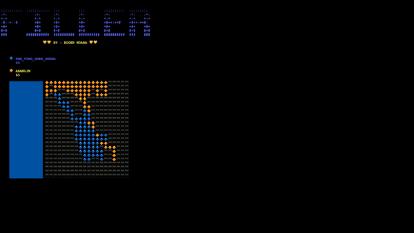

# filler

**Not the best algorith out here, actualy not even an algorithm. I
just go for the centre if it's possible to place there, then place. If
I can nolonger place at the centre because of the enemey being too close,
I just go around them.**

